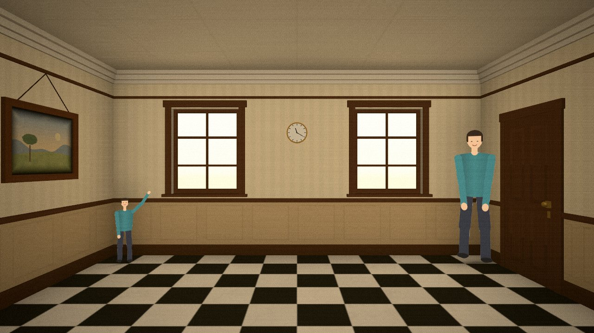
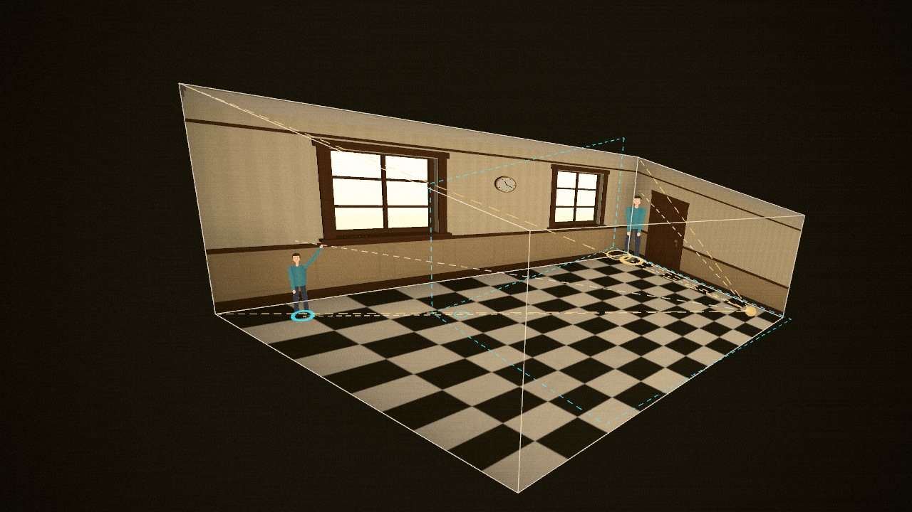
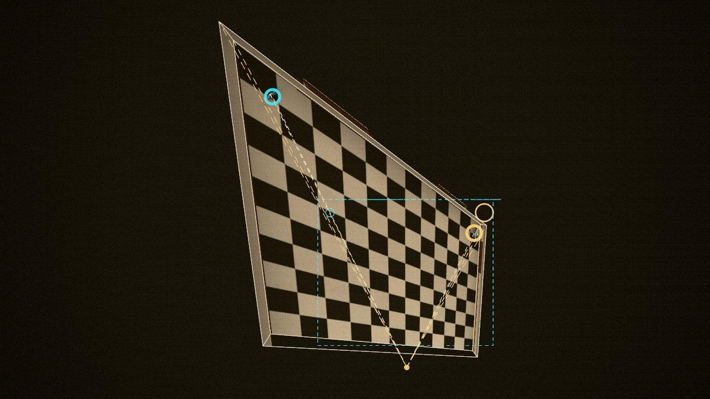

# Ames Room

Put yourself, live from your webcam and cut out from your background, inside a
virtual **Ames room**. From the hero camera it looks like a perfectly normal
rectangular room, but it is really a warped trapezoid: walk to the left and you
shrink into a tiny person, walk to the right and you grow into a giant. Then the
camera orbits away to reveal the room's true shape and glides back to lock the
illusion again.

It also records MP4 for X/Twitter (16:9, 9:16 or 1:1), has a **two of me** ghost
mode, and a **director mode** that runs a 30-second guided take for you.

Everything runs locally in the browser (Vite + TypeScript + Three.js + lil-gui +
MediaPipe Tasks Vision). No backend, and your video never leaves your machine.

| Hero view: tiny twin, giant me | Reveal: same size, trapezoid room | Top view: the classic plan |
| --- | --- | --- |
|  |  |  |

*(Screenshots use the built-in demo performer.)*

## Setup

```bash
npm install
npm run dev          # open the printed http://localhost:5173 URL
```

`npm run build` makes a static site in `dist/` (it type-checks first) and
`npm run preview` serves it. `npm test` runs the unit tests (warp math, mask
processing). Camera access needs `https://` or `localhost`.

No webcam handy? Click **Try the demo performer** (or open `/?demo=1`): a
synthetic person walks through the same pipeline, so every feature works.
`/?demo=upper` frames the performer like a laptop camera (no feet), which shows
the upper-body counter mode. You can switch cameras, or to the demo, at any time
in *Settings → Source*.

### Getting a good cutout

- **Use your phone as the webcam.** On a Mac, iPhone *Continuity Camera* shows up
  as a normal camera; on Android use *DroidCam*. Laptop cameras can't see your feet.
- **Stand 2.5 to 3 m back** so your whole body, head to feet, is in the frame, and
  keep the phone at about waist height, level.
- **Plain background, even lighting.** Avoid a bright window behind you.
- **Move sideways slowly**, parallel to the camera. Your left is the room's far
  (tiny) corner; your right is the near (giant) corner.
- If your feet are not in the frame, the app switches to **upper-body mode**:
  a waist-high counter appears along the back wall and you stand behind it, so
  the counter hides the cut.
- The bottom-left preview shows what the camera sees (mirrored), with your cutout
  in cyan. The two dashed lines mark the part of the frame that maps onto the
  room: stand on the left line for the far corner and on the right line for the
  near one (adjust them in *Settings → Walking line*).

## Controls

| Key | Action |
| --- | --- |
| <kbd>Space</kbd> | Reveal (orbit away) / Return (glide back and lock the illusion) |
| <kbd>T</kbd> | Top view, like the classic plan diagram |
| <kbd>G</kbd> | Record a 10 s ghost take (press again to end it early) |
| <kbd>X</kbd> | Clear the ghost |
| <kbd>R</kbd> | Record video (3-2-1 countdown, press again to stop) |
| <kbd>D</kbd> | Director mode (guided 30 s recording) |
| <kbd>S</kbd> | Settings |
| <kbd>H</kbd> | Hide all UI |
| <kbd>Esc</kbd> | Cancel a countdown or director mode |
| drag | Orbit around while revealed |
| <kbd>←</kbd> <kbd>→</kbd> / <kbd>W</kbd> | Move / wave the demo performer |

## How the illusion works (in plain words)

1. **Pick an eye.** The hero camera sits at a fixed point *E*, a little in front of
   the room's open front at eye height.
2. **Draw the room you want people to see.** An ordinary box: 6 m wide, 3 m tall,
   5 m deep, with a checkerboard floor, two windows, a door, a painting, a clock,
   skirting boards and a cornice. Every straight line and right angle in it is a
   cue your brain uses to decide "this room is rectangular".
3. **Slide every point along its own line of sight.** For each point *V* of that
   box, take the ray from the eye through it (*X = V − E*) and move the point
   along that ray:

   ```text
   X' = X / (1 + w·X)        real point  V' = E + X'
   ```

   Because each point only moves *along its own sight line*, the eye sees exactly
   the same picture: the real room and the imagined one are pixel-identical from
   *E*. And because this is a projective map, flat things stay flat and straight
   lines stay straight, so walls, floor tiles and window frames still look perfect.
4. **Choose the push.** `w = (wx, 0, wz)` is solved so the back-left corner is
   pushed **2× farther** away and the back-right corner is pulled in to **0.85×**
   (sliders in *Settings → Warp*). `w` has no vertical part, so real verticals stay
   vertical. The app checks that `1 + w·X` stays positive everywhere (otherwise the
   room would fold through the eye) and softens the warp if it would not.
5. **Stand a real-sized person in it.** You are a card with a fixed real height
   (1.75 m, configurable), standing upright on the *real*, tilted floor. Nothing
   ever scales you. In the far-left corner the real room is twice as far away and
   twice as tall, so you fill half as much of it and look half size; in the
   near-right corner you look about 1.2× bigger. From the default walking line that
   is a change of about **2.1×** in apparent height.
6. **Reveal.** Move the camera away from *E* and the trick falls apart: the floor
   is tilted, the back wall is a trapezoid (about 6 m tall at the left, 2.6 m at the
   right), and both of you are the same size. The reveal camera is placed where it
   is equally far from both ends of the walking line, so that is easy to see.

The textures survive the warp exactly: every room fragment inverts the warp
(`X = X' / (1 − w·X')`) to find its apparent-space position, and all patterns,
lighting and ambient occlusion are computed there. Large surfaces are also heavily
subdivided and every pattern element (floor tile, window bar, moulding) is real
geometry. Lighting is soft and computed in apparent space, with no real-time
shadow maps, so nothing betrays the true shape from the hero view.

At startup the app projects every room vertex and its warped twin through the
hero camera at 16:9, 9:16 and 1:1 and logs the worst pixel difference
(it must be under 0.5 px; in practice it is around 0.0003 px). Turn on
*Settings → Debug → apparent room wireframe* to see the imagined room drawn over
the real one: from the hero view they line up exactly.

## Recording tips

- **Record** captures only the 3D canvas: the toolbar, settings, countdown and
  director cues are never in the video. Captions in director mode are part of the
  picture (turn them off in *Settings → Recording*).
- Pick the aspect in *Settings → Recording*: **16:9** (1920×1080), **9:16**
  (1080×1920, for Reels/Shorts/TikTok) or **1:1** (1080×1080). The hero camera keeps
  the exact same eye point for every aspect, only its field of view changes, so
  the illusion stays pixel-exact. *fill* records the window's shape.
- The app records **MP4 (H.264)** when the browser can encode it (Chrome, Edge,
  Safari) and **WebM** otherwise (e.g. Firefox). To convert a WebM for X/Twitter:

  ```bash
  ffmpeg -i ames-room.webm -c:v libx264 -pix_fmt yuv420p -crf 18 -c:a aac -movflags +faststart ames-room.mp4
  ```

  If an upload site rejects a browser-made MP4, remux it in place:
  `ffmpeg -i in.mp4 -c copy -movflags +faststart out.mp4`.
- Your scale is frozen while recording, so your size never drifts mid-take.
- **Director mode** (<kbd>D</kbd>) records 30 s and tells you what to do:
  1. 0–4 s: hero view, *"a normal room."* Stand in the **left** corner.
  2. 4–10 s: *walk right slowly*: you grow into a giant.
  3. 10–15 s: your ghost appears in the far corner (if you recorded one). Look down at it.
  4. 15–23 s: the camera orbits to reveal the real room: *"the room isn't square."*
  5. 23–30 s: it glides back and locks the illusion: *"your brain just assumes it is."*
- **Two of me:** press <kbd>G</kbd>, go to the far (left) corner and wave up at
  your future self for 10 s. The take then loops as a second you. Stand in the near
  (right) corner and look down at your tiny twin. Both of you cast contact shadows.

## Troubleshooting

- **The chip says "upper body · counter" but I wanted my whole body:** your feet
  are touching the bottom of the frame. Step back or lower/tilt the phone until
  there is floor below your shoes. You can also force *Settings → Me → body mode*.
- **I look too tall or too short:** set *my real height*, stand tall with your
  whole body in view and press *recalibrate my height*. *Lock my scale* keeps it.
- **Ragged or flickering edges:** use a plainer background and more even light,
  raise *temporal smoothing* or *edge erosion*, or try the *multiclass* model.
- **The room edges don't line up:** turn on *Debug → apparent room wireframe*; if
  the cyan lines don't sit exactly on the room from the hero view, check the
  console for the alignment report (it should say PASS).
- **Segmentation won't start:** the app tries a Web Worker with the GPU, then the
  CPU, then the main thread. Add `?worker=0` to the URL to force the main-thread
  path. Camera access needs `https://` or `localhost`.

## Performance

Rendering runs at display rate while segmentation runs at up to 30 fps in a Web
Worker (MediaPipe *selfie segmenter*, GPU delegate, with CPU and main-thread
fallbacks). Each camera frame is cropped to a square around you before
segmentation, so the model sees you at full resolution and the colour pixels and
the mask always come from the same frame. The mask is smoothed over time,
slightly eroded and feathered, and the crop box, scale and position are
stabilised (the walk uses a critically damped spring), so edges don't flicker.

## Project layout

| File | What it does |
| --- | --- |
| `src/warp.ts` | The projective warp: solve `w`, forward and inverse maps, validity checks |
| `src/room.ts` | Room geometry built in apparent space, warping, styles, cutaway, overlays |
| `src/roomShader.ts` | Room shading: apparent-space patterns, lighting, AO, contact and wall shadows |
| `src/person.ts` | Body tracking (scale, feet, crop, full/upper body) and the cutout card |
| `src/segment.ts` | Webcam capture, ROI cropping, worker/main-thread segmentation backends |
| `src/segment.worker.ts`, `src/mediapipe.ts` | MediaPipe ImageSegmenter wrapper, runs in a worker |
| `src/maskproc.ts` | Mask smoothing, resampling and statistics (bbox, feet, head, shoulders) |
| `src/walk.ts` | Webcam x → walking line mapping with a critically damped spring |
| `src/camera.ts` | Hero / reveal / top poses, eased orbits and the illusion-lock settle |
| `src/ghost.ts` | Records and replays the ghost take (GPU texture-array frames) |
| `src/recorder.ts` | MediaRecorder: MP4 or WebM |
| `src/director.ts` | Director-mode timeline |
| `src/ui.ts` | Toolbar, onboarding, cues, settings panel (lil-gui) |
| `src/post.ts` | Grade, vignette, film grain and burned-in captions |
| `src/checks.ts` | Startup pixel-alignment check and size-ratio check |
| `src/demo.ts` | The synthetic demo performer |
| `src/main.ts` | Wiring and the render loop |

The selfie segmentation model (`public/models/selfie_segmenter.tflite`) and the
MediaPipe wasm runtime are served locally, so the app works offline. The optional
*multiclass* model (sharper hair and clothing edges, 16 MB) is fetched from
Google's model storage when you select it.

## Credits

- Segmentation: [MediaPipe Tasks Vision](https://ai.google.dev/edge/mediapipe/solutions/vision/image_segmenter)
  and its *selfie segmenter* model (`public/models/selfie_segmenter.tflite`), both
  by Google under the Apache License 2.0.
- Rendering: [three.js](https://threejs.org); settings panel: [lil-gui](https://lil-gui.georgealways.com).
- The Ames room is named after Adelbert Ames Jr., who built the first one in 1946.
